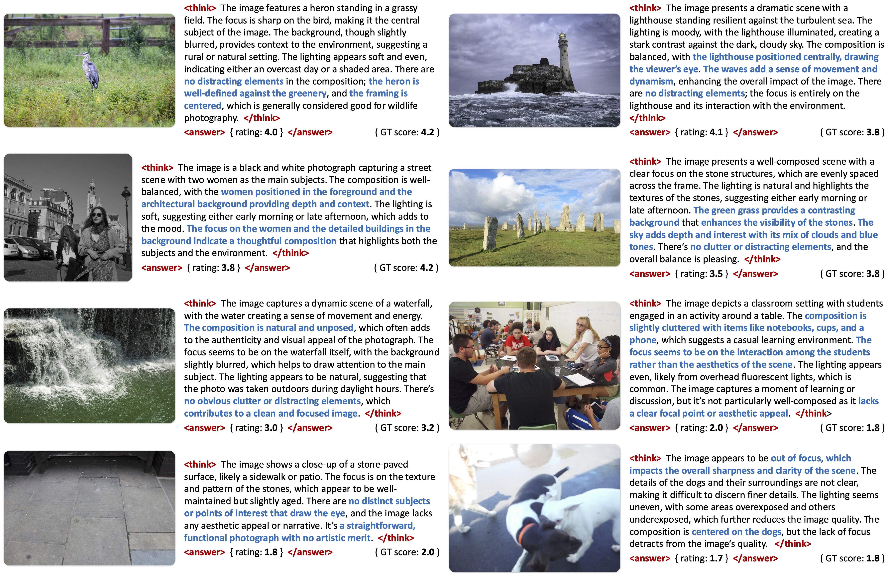
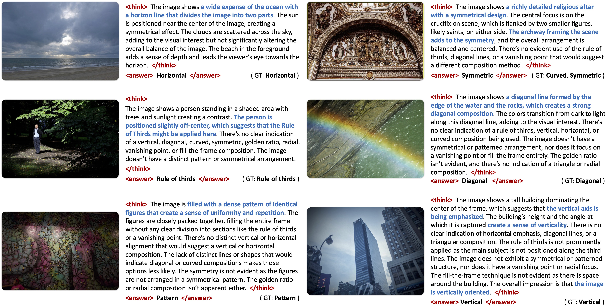

<div align="center">

  <h3> This Repository provides the source code of Composition Assessment Model in 
  <a href="https://zhiyuanyou.github.io/photoframer/" target="_blank">PhotoFramer</a>.</h3>

  <h1>PhotoFramer: Multi-modal Image Composition Instruction</h1> 

<div>
    <a href="https://zhiyuanyou.github.io/" target="_blank">Zhiyuan You</a>,
    <a href="https://kewang0622.github.io/" target="_blank">Ke Wang</a>,
    <a href="https://sites.google.com/site/hezhangsprinter" target="_blank">He Zhang</a>,
    <a href="https://caixin98.github.io/" target="_blank">Xin Cai</a>,
    <a href="https://www.jasongt.com/" target="_blank">Jinjin Gu</a>,
    <a href="https://tianfan.info/" target="_blank">Tianfan Xue</a><sup>#</sup>,
    <a href="https://xpixel.group/2010/01/20/chaodong.html" target="_blank">Chao Dong</a><sup>#</sup>,
    <a href="https://ztzhang.info/" target="_blank">Zhoutong Zhang</a>
</div>

<div><sup>#</sup>Corresponding author</div>

<div>
  <a href="https://zhiyuanyou.github.io/photoframer/" target="_blank"><strong>Homepage</strong></a> | 
  <a href="https://huggingface.co/zhiyuanyou/Qwen2.5-VL-7B-GRPO-Composition-Score-Class" target="_blank"><strong>Assessment Model Weights</strong></a> | 
  <a href="https://huggingface.co/datasets/zhiyuanyou/Datasets-PhotoFramer-Assessment" target="_blank"><strong>Assessment Datasets</strong></a> | 
  <a href="https://arxiv.org/abs/2512.00993" target="_blank"><strong>Paper</strong></a>
</div>

<h2>Composition Assessment Results</h2>
<div style="width: 100%; text-align: center; margin:auto;">
      
</div>

<h2>Composition Classification Results</h2>
<div style="width: 100%; text-align: center; margin:auto;">
      
</div>
</div>


## 🛠️ Setup

```bash
conda create -n vlm-r1 python=3.10
conda activate vlm-r1
bash setup.sh
```

## 💪🏻 Training, Inference & Evaluation

### Datasets

- Download our meta files from [Huggingface Metas](https://huggingface.co/datasets/zhiyuanyou/Datasets-PhotoFramer-Assessment). 

- Download all source images from AVA, CADB, GAIC, and KUPCP datasets. 

- Arrange the folders as follows. Note that `train_img_1024` and `test_img_1024` folders (under `KU_PCP_Dataset` folder) are generated by running `resize_img.py` (under `KU_PCP_Dataset` folder).

```
|-- PhotoFramer-Assessment
  |-- Datasets
    |-- AVA_dataset
      |-- ava_images/*.jpg
      |-- metas
    |-- CADB_Dataset
      |-- images/*.jpg
      |-- metas
    |-- GAIC
      |-- images/train/*.jpg
      |-- images/test/*.jpg
      |-- metas
    |-- KU_PCP_Dataset
      |-- train_img/*.jpg
      |-- train_img_1024/*.jpg
      |-- test_img/*.jpg
      |-- test_img_1024/*.jpg
      |-- metas
      |-- resize_img.py
```

### Pretrained Weights 

If you would like to **evaluate** the model, download assessment model weights ([Qwen2.5-VL-7B-GRPO-Composition-Score-Class](https://huggingface.co/zhiyuanyou/Qwen2.5-VL-7B-GRPO-Composition-Score-Class)), then arrange the folders as follows. 

```
|-- PhotoFramer-Assessment
  |-- src
    |-- open-r1-multimodal
      |-- output
        |-- Qwen2.5-VL-7B-GRPO-Composition-Score-Class
```

If you would like to **train** the model, download [Qwen2.5-VL-7B-Instruct](https://huggingface.co/Qwen/Qwen2.5-VL-7B-Instruct), then arrange the folders as follows.

```
|-- PhotoFramer-Assessment
  |-- ModelZoo
    |-- Qwen2.5-VL-7B-Instruct
```

### GRPO Training

After preparing the datasets and base model weights, you can train the model. 

- At least **8 A6000 GPUs** or **4 A100 GPUs** will be enough. Revise `--data_paths`, `--weights`, and `--tasks` in the training shell to load different datasets. 

```shell
cd PhotoFramer-Assessment/src/open-r1-multimodal
sh run_scripts/run_grpo_train.sh
```

### Inference

After preparing the datasets and pre-trained model weights, you can infer using pre-trained weights. 

- Revise `DATA_JSONS` and `TASKS` in the script to infer different datasets.

```shell
cd PhotoFramer-Assessment/src/eval
torchrun --nproc_per_node=8 infer_r1.py
```

### Evaluation

After inference, you can evaluate the inference results. 

- SRCC / PLCC for composition assessment. Revise `INFER_JSON` in the script to evaluate different results.

```shell
cd PhotoFramer-Assessment/src/eval
python cal_srcc_plcc.py
```

- Accuracy for composition classification. Revise `INFER_JSON` in the script to evaluate different results.

```shell
cd PhotoFramer-Assessment/src/eval
python cal_srcc_plcc.py
```

## 🤝 Acknowledgement

This work is based on [VLM-R1](https://github.com/om-ai-lab/VLM-R1). Sincerely thanks for this awesome work.

## ⭐️ Citation

If you find our work useful for your research and applications, please cite using the BibTeX:

```bibtex
@inproceedings{photoframer,
    title={PhotoFramer: Multi-modal Image Composition Instruction},
    author={You, Zhiyuan and Wang, Ke and Zhang, He and Cai, Xin and Gu, Jinjin and Xue, Tianfan and Dong, Chao and Zhang, Zhoutong},
    booktitle={IEEE/CVF Conference on Computer Vision and Pattern Recognition},
    year={2026}
}
```
